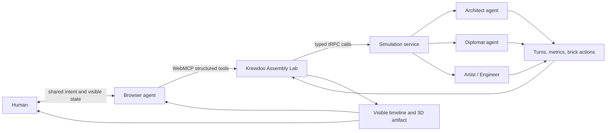

# Krewdoo Assembly Lab

**A human-guided, multi-agent assembly protocol exposed through WebMCP.**

Krewdoo is an agentic assembly platform. Its first flagship experience, **Krewdoo Assembly Lab**, lets a person and their browser agent configure a team of specialist AI agents, give them a constrained creative mission, advance their work turn by turn, inspect the shared 3D artifact, and analyze how the crew collaborated. The browser agent does not click blindly through the interface: the page exposes a structured WebMCP tool chain while every action remains visible to the human.

## Why WebMCP

Multi-agent configuration is normally a long, error-prone sequence of UI interactions: compare scenarios, inspect agent capabilities, select a complementary crew, set a turn budget, run the experiment, and interpret the result. WebMCP makes that workflow explicit and reliable. A browser agent can discover the site's capabilities, use validated parameters, act on the same state the human sees, and return concise structured results.

> Example prompt: “Choose the bridge challenge, pair an architect with a diplomat, run four observable turns, and explain whether the crew collaborated well.”

## WebMCP tool chain

| Stage | Tools | Human-visible result |
|---|---|---|
| Discover | `list_scenarios`, `list_agent_presets` | The agent understands available challenges and specialists |
| Configure | `configure_mission`, `preview_mission` | Scenario, crew, mode, and turn budget update on screen |
| Execute | `run_next_turn`, `run_simulation` | Agent messages, metrics, and the 3D assembly evolve visibly |
| Understand | `inspect_collaboration`, `analyze_collaboration` | The agent reports progress and collaboration patterns |
| Reset | `reset_mission` | The local experiment returns to a clean state |

The tool definitions live in [`client/src/lib/webmcp/assemblyTools.ts`](client/src/lib/webmcp/assemblyTools.ts), lifecycle registration lives in [`client/src/hooks/useWebMCPTools.ts`](client/src/hooks/useWebMCPTools.ts), and the shared human/agent interface lives in [`client/src/pages/Sandbox.tsx`](client/src/pages/Sandbox.tsx).

## What was added for the WebMCP Challenge

This was an existing multi-agent creative platform before the challenge. The work created during the submission period is intentionally isolated and documented:

| New work | Evidence |
|---|---|
| Nine-tool imperative WebMCP contract | Dated commits affecting `assemblyTools.ts` |
| Abort-aware registration lifecycle | `useWebMCPTools.ts` |
| Shared browser-agent and human state | Assembly Lab page changes |
| Visible support/readiness/activity panel | Assembly Lab page changes |
| Security annotations and bounded schemas | Tool contract tests |
| Deterministic tool-chain tests | `server/webmcp-tools.test.ts` |
| Competition plan and architecture rationale | `docs/webmcp-competition-plan.md` |

Only the WebMCP extension added after August 25, 2026 is presented for judging.

## Run locally

```bash
pnpm install
pnpm dev
```

Open `http://localhost:3000/sandbox`. The rest of the app remains usable in ordinary browsers; WebMCP is a progressive enhancement.

## Test with WebMCP

Use ChatGPT's in-app browser, or Chrome 149+ with `chrome://flags/#enable-webmcp-testing` enabled. Visit `/sandbox`, confirm the page reports that nine tools are ready, and try the example prompt above.

For deterministic verification:

```bash
pnpm check
pnpm exec vitest run server/webmcp-tools.test.ts server/sandbox.test.ts
```

The tests verify unique tool names, concise descriptions, bounded JSON Schemas, correct safety annotations, cancellation propagation, and the intended discover → configure → execute → inspect → analyze chain.

## Architecture



## Security design

Tool inputs use restrictive JSON Schemas with bounded crew and turn counts. Read-only behavior is identified with `readOnlyHint`; outputs containing model-generated text use `untrustedContentHint`. WebMCP tools are registered only for the current document and are unregistered on page teardown. Long-running tool handlers receive and check the browser-provided cancellation signal. No cross-origin exposure is enabled.

## Technology

React 19, TypeScript, tRPC, Express, Three.js / React Three Fiber, Vitest, and the WebMCP imperative API.

## License

Released under the [MIT License](LICENSE).
