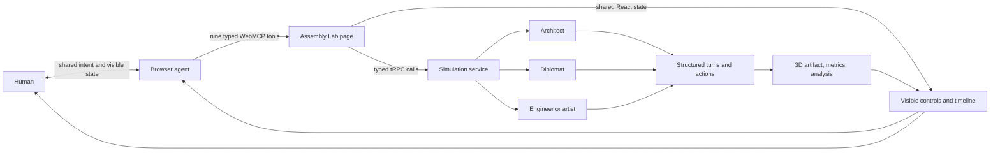

# LEGO Claw: Assembly Lab

**One browser agent assembles a whole creative crew.**

LEGO Claw is an agentic creation platform. Its WebMCP competition experience, **Assembly Lab**, lets a person ask a browser agent to discover collaboration scenarios, select complementary specialist agents, configure a bounded mission, advance the crew one turn at a time, inspect the evolving 3D result, and analyze how the agents worked together.

The browser agent does not guess at screen coordinates. The page deliberately exposes a typed nine-tool workflow through the WebMCP imperative API, and every state-changing action updates the same interface the human sees.[1]

> **Important trademark note:** LEGO is a trademark of the LEGO Group, which does not sponsor, authorize, or endorse this independent project. The entrant must resolve the competition's third-party-trademark requirements before submitting this brand or showing it in the required video.[2]

## Judge quick start

| Resource | URL or command |
|---|---|
| Competition story | [https://legoclaw.com/webmcp](https://legoclaw.com/webmcp) |
| Interactive judge demo | [https://legoclaw.com/sandbox](https://legoclaw.com/sandbox) |
| Suggested prompt | `Choose the bridge challenge, pair an architect with a diplomat, run four observable turns, then explain whether they collaborated well.` |
| Local development | `pnpm install && pnpm dev` |
| Full validation | `pnpm check && pnpm test && pnpm build` |

Use ChatGPT's in-app browser or Chrome 149+ with WebMCP enabled. Open the judge demo and confirm the readiness panel reports **9 tools ready**. The ordinary interface remains usable without WebMCP because the integration is a progressive enhancement.[3]

## Why WebMCP

Configuring a multi-agent experiment is normally a long sequence of UI operations: compare scenarios, inspect specialist capabilities, select a complementary crew, set constraints, advance the experiment, and interpret the outcome. WebMCP turns that sequence into an explicit, discoverable contract. The browser agent receives validated identifiers, bounded inputs, accurate safety annotations, structured results, and cancellation support instead of relying on brittle visual automation.[1] [4]

| Stage | Tools | Human-visible result |
|---|---|---|
| Discover | `list_scenarios`, `list_agent_presets` | The agent learns the supported challenges and specialists |
| Configure | `configure_mission`, `preview_mission` | The scenario, crew, mode, and turn budget update on screen |
| Execute | `run_next_turn`, `run_simulation` | Messages, metrics, and the 3D assembly evolve visibly |
| Understand | `inspect_collaboration`, `analyze_collaboration` | Progress and collaboration patterns become inspectable |
| Reset | `reset_mission` | The local experiment returns to a clean state |

The canonical tool contract is in [`client/src/lib/webmcp/assemblyTools.ts`](client/src/lib/webmcp/assemblyTools.ts). Lifecycle registration is in [`client/src/hooks/useWebMCPTools.ts`](client/src/hooks/useWebMCPTools.ts), and the shared human/agent interface is in [`client/src/pages/Sandbox.tsx`](client/src/pages/Sandbox.tsx).

## What is new for the challenge

LEGO Claw existed before the submission period. The work presented for judging is the WebMCP extension created after the challenge opened on August 25, 2026. The main implementation landed in commit [`d8321b8`](https://github.com/mlmrx/lego-claw-platform/commit/d8321b8), dated September 1, 2026, with later hardening and verification captured in [`5fb27e3`](https://github.com/mlmrx/lego-claw-platform/commit/5fb27e3).[2]

| Submission-period work | Evidence |
|---|---|
| Nine-tool imperative WebMCP contract | `client/src/lib/webmcp/assemblyTools.ts` |
| Abort-aware registration lifecycle | `client/src/hooks/useWebMCPTools.ts` |
| Shared browser-agent and human mission state | `client/src/pages/Sandbox.tsx` |
| Dedicated competition explanation | `client/src/pages/WebMCPShowcase.tsx` |
| Same-origin WebMCP response headers | `server/_core/index.ts` |
| Strict structured turn and analysis responses | `server/sandboxRouter.ts` |
| Deterministic tool-contract tests | `server/webmcp-tools.test.ts` |
| Open-source implementation and test guide | `README.md`, `LICENSE`, `docs/` |

See [`docs/new-vs-preexisting.md`](docs/new-vs-preexisting.md) for the complete boundary between the existing platform and the judged extension.

## Architecture



## Security and trust

Tool inputs use restrictive JSON Schemas. Read-only operations carry `readOnlyHint`; outputs that can contain model-generated text carry `untrustedContentHint`. Tools register only for the current document and unregister on teardown. Long-running handlers receive the browser-provided cancellation signal. The server enables an origin-keyed agent cluster and restricts `Permissions-Policy: tools` to the same origin. No cross-origin tool exposure is enabled.[4]

The mission contract permits two to four agents and four to twelve turns. The judge-demo button prepares a four-turn mission but does not execute it. Step-by-step mode gives the human a review point between every generated turn.

## Run and test locally

```bash
pnpm install
pnpm dev
```

Then open `http://localhost:3000/sandbox` in a WebMCP-capable browser.

```bash
pnpm check
pnpm test
pnpm build
pnpm exec tsc -p sdk/typescript/tsconfig.json
```

The finalized competition checkpoint passed **372 tests across 30 test files**, TypeScript validation, the production build, and the standalone SDK build. The active managed checkpoint is `4415bd9e`.

## Repository and license

This project is released under the [MIT License](LICENSE). The Devpost rules require this repository to be **public** and the license to be visible before submission.[2] If this page is being viewed in a private repository, the submission is not yet compliant.

## References

[1]: https://developer.chrome.com/docs/ai/webmcp/imperative-api "WebMCP imperative API"
[2]: https://webmcp.devpost.com/rules "WebMCP Challenge official rules"
[3]: https://webmcp.devpost.com/resources "WebMCP Challenge resources and FAQ"
[4]: https://developer.chrome.com/docs/ai/webmcp/secure-tools "Secure WebMCP tools"
